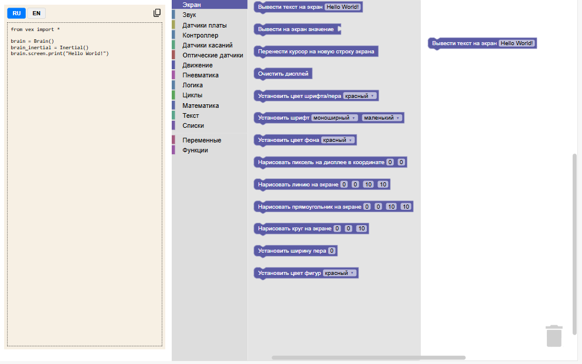

[English](README.md)

# VexIQBlockly

Визуальный конструктор программ для роботов *VEX IQ 2 Generation*.

## О проекте

**VexIQBlockly** — это инструмент, который позволяет программировать роботов *VEX IQ 2 Gen* с помощью визуальных блоков, как из кубиков. Вы собираете программу в браузере, а VexIQBlockly автоматически превращает её в код на языке *Python*. Готовый код можно скопировать и вставить в Visual Studio Code, а затем загрузить на робота.



Инструмент создавался для учителей и учеников, которые только начинают знакомиться с робототехникой. Блоки помогают понять логику работы робота, не отвлекаясь на синтаксис языка.

Проект построен на основе [Google Blockly](https://www.blockly.com/) и использует стандартный шаблон Blockly Sample App.

## Возможности
- Собирать программы из визуальных блоков в браузере.
- Автоматически переводить блоки в код Python.
- Работать с основными компонентами VEX IQ 2 Gen:
    - Экран (вывод текста и изображений).
    - Звук (ноты и сигналы).
    - Датчики платы (кнопки, аккумулятор, гироскоп).
    - Управление с контроллера.
    - Датчики касаний (бампер, сенсор касания).
    - Оптические датчики.
    - Движение (моторы и шасси).
    - Пневматика.
- Сохранять ваши проекты в браузере (даже после перезагрузки страницы).

## Быстрый старт
Всё, что нужно, чтобы начать работать с VexIQBlockly:
1. Убедитесь, что у вас установлен Node.js (он нужен для работы инструмента).
2. Скачайте или склонируйте этот репозиторий.
3. Откройте терминал в папке с проектом и выполните команду:
```bash
npm install
```
4. Запустите локальный сервер:
```bash
npm run start
```
5. Дождитесь запуска сервера. В браузере автоматически откроется страница конструктора блоков по адресу http://localhost:8081/.

## Лицензия

Проект распространяется под лицензией MIT. Подробнее — в файле LICENSE.

